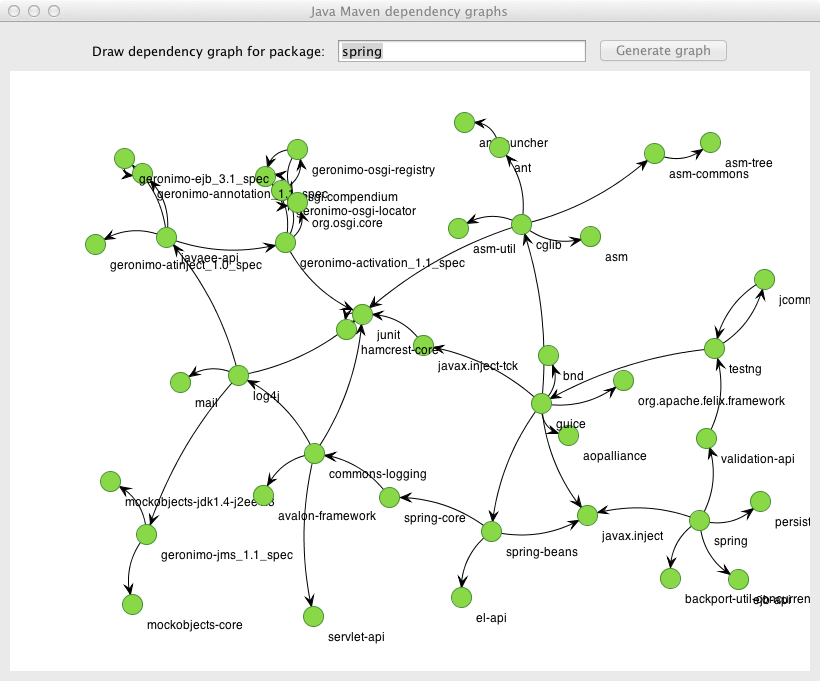

# Maven dependency walker

This program looks for a Java software package on [mvnrepository.com](http://mvnrepository.com/) and recursively finds all dependent packages, displaying a dependency [graph](http://en.wikipedia.org/wiki/Graph_%28mathematics%29) on a GUI.

## Example Usage

Input a query string and click on "Generate graph". The first package result on mvnrepository.com will be taken as starting package.

_Trying with complex packages builds interesting results, eg. spring or hibernate._

# Build From Sources

Call `ant` on the command line to build the application jarfile from sources. The artifact can be found in the `dist` folder.

# License

See the LICENSE file.
